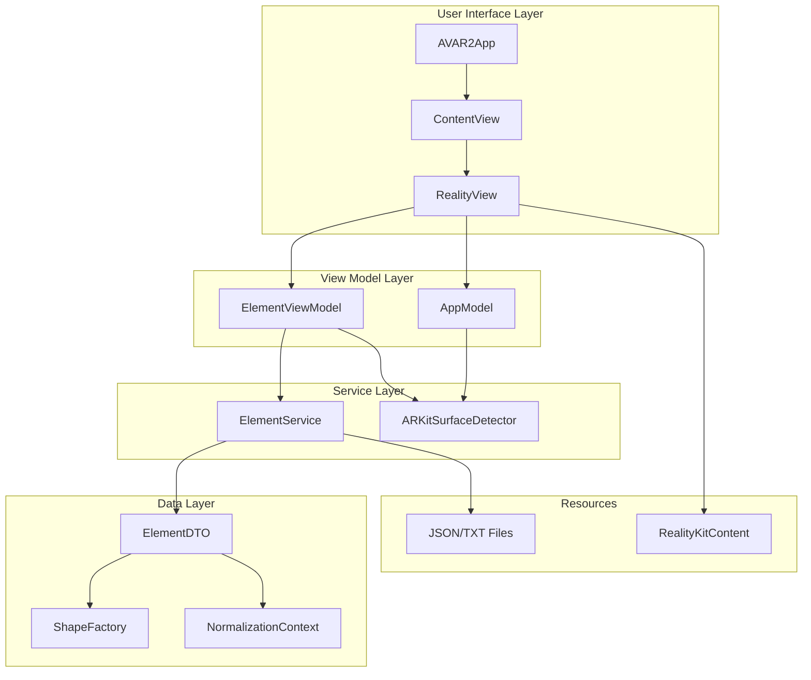
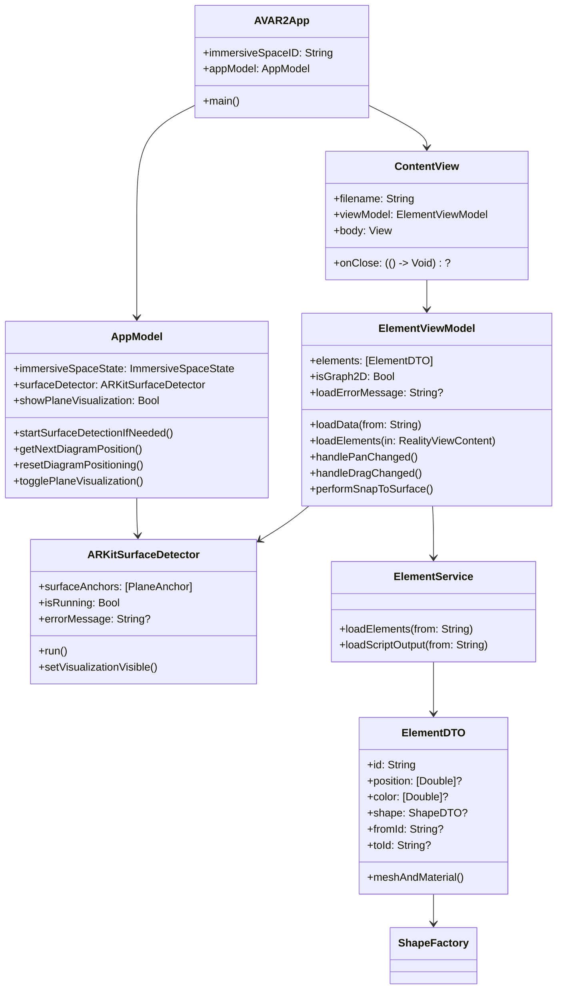
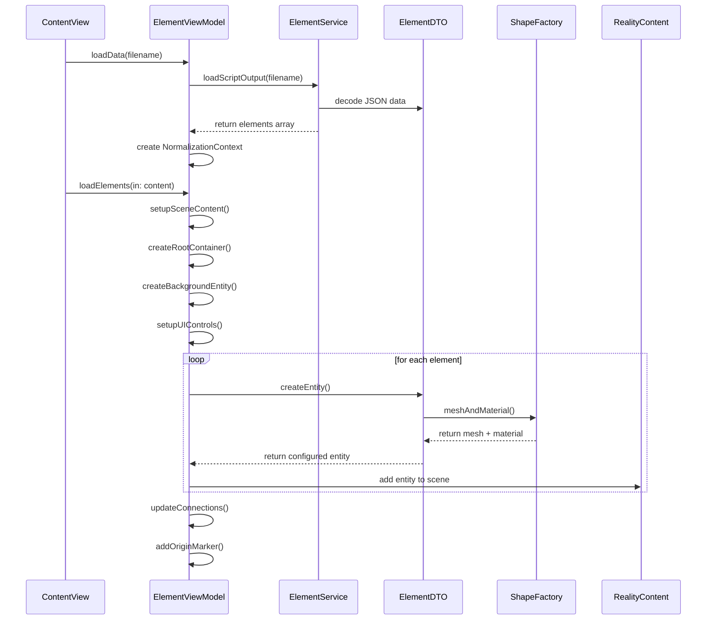
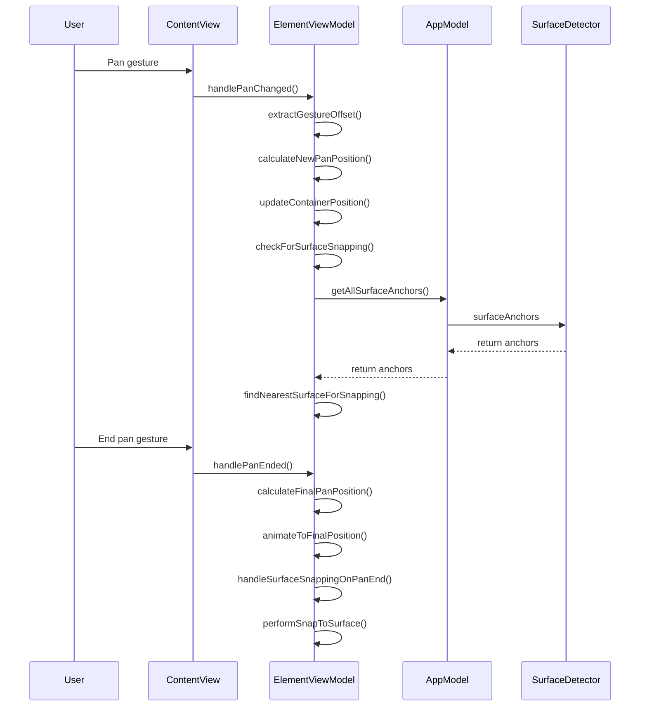
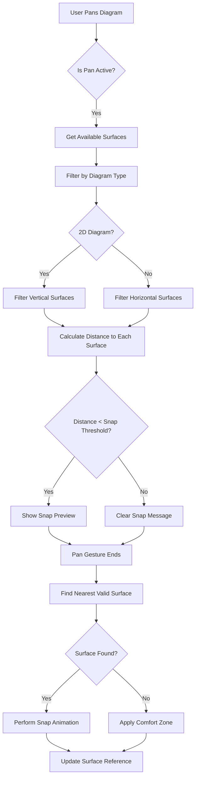
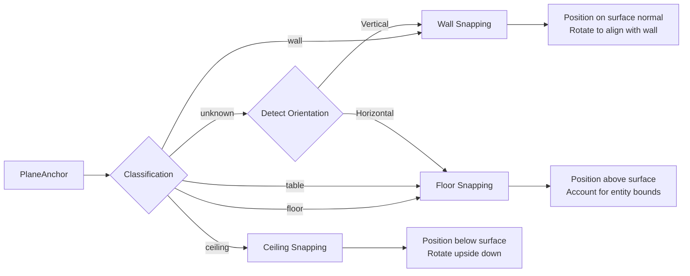
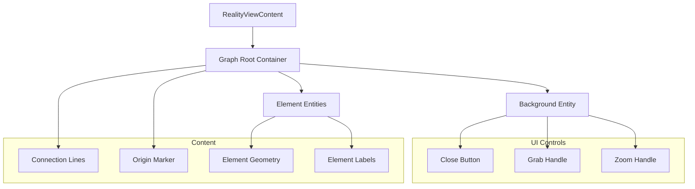
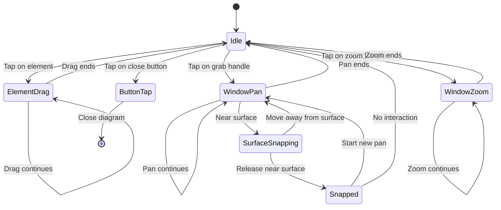

# AVAR2 - Architecture Diagrams

This document contains all the mermaid diagrams referenced in the main [ARCHITECTURE.md](./ARCHITECTURE.md) file.

## High-Level System Architecture

## Component Class Diagram

## Diagram Loading Sequence

## User Interaction Sequence

## Surface Snapping Logic Flowchart

## Surface Classification and Snapping

## Entity Hierarchy and Scene Graph

## Gesture State Machine

---

*These diagrams provide visual representations of the AVAR2 architecture and can be rendered in any mermaid-compatible viewer.*