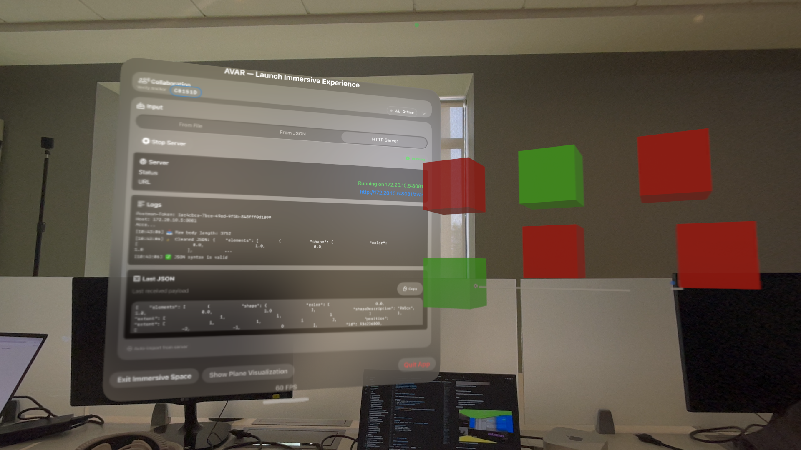
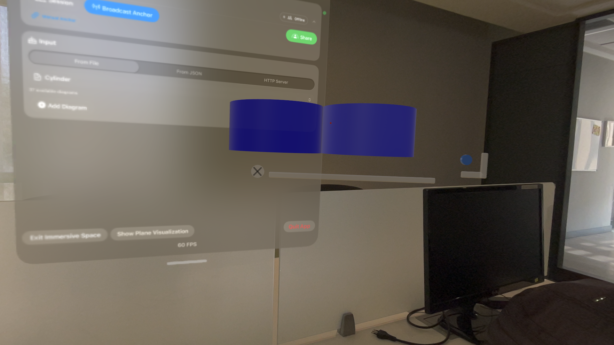
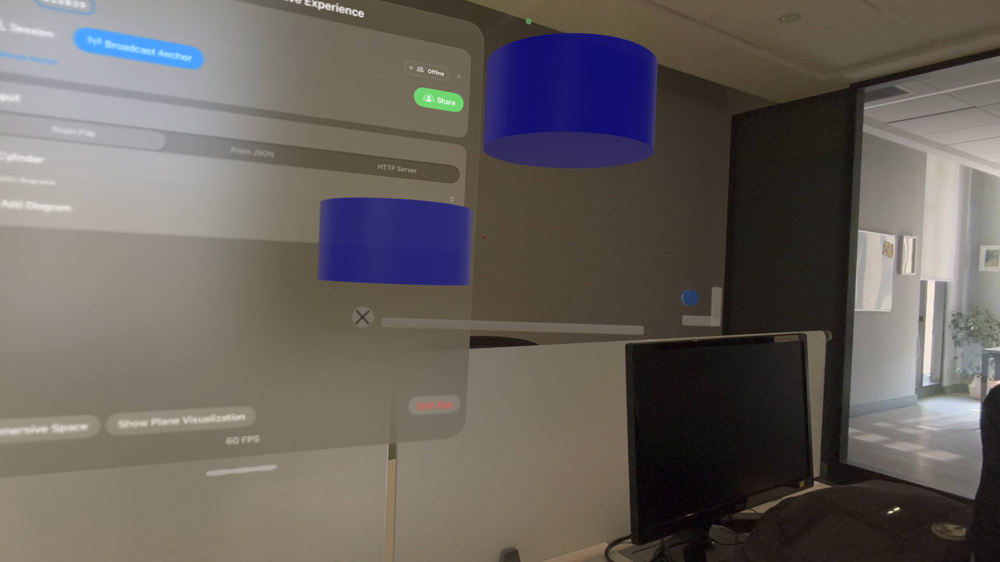
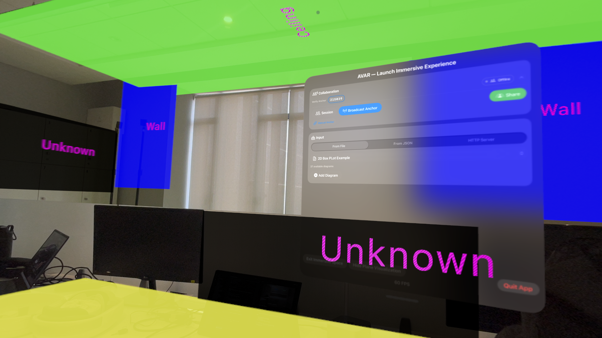

# AVAR2 – User Interaction Guide 

## 1) Document metadata

- Project name: **AVAR2**
- Version / build number: `51`
- Date: `15-01-2026`
- Authors / maintainers: `Mateo de la Cuadra Copetta & Roberto Riquelme`
- Devices tested:
  - Vision Pro: `(iOS 26.1)`
  - iPhone/iPad model(s): `__________`
- Known limitations for this version: `Diagram sharing positioning (not on sync)`

---

## 2) Screenshot checklist

Use this checklist to ensure you capture everything once.

### visionOS screenshots

- [ X ] Launcher window – **Input Source** picker and **Load** button
- [ X ] Launcher window – **HTTP Server** panel + logs + last JSON
- [ X ] Launcher window – **Collaboration card** (collapsed and expanded)
- [ X ] Collaborative Session sheet (participants list)
- [ X ] Immersive diagram with visible handles (grab/zoom/rotate/close)
- [ X ] Plane visualization ON
- [ X ] Multiple diagrams open (layout)

### iOS screenshots

- [ ] AR view with a shared diagram visible
- [ ] Bottom-right **Controls** menu expanded
- [ ] Bottom status strip (anchor status + diagram count)
- [ ] Collaborative Session sheet on iOS
- [ ] “Help” sheet (overlay guide)

---

## 3) visionOS (Apple Vision Pro)

### 3.1 Launch experience

**What the user sees:**
- The app opens into a **launcher window** (“main window”).
- This window is where you choose an input source, start/stop the HTTP server, and manage collaboration.


Caption: `Main Window`

---

### 3.2 Collaboration card (top of launcher)

The Collaboration card displays information and allows interaction with everything related to multiplayer.


Caption: `Collaboration Card`

**User actions:**

1) **Open session details**
- Tap: `Session`
- Expected result: shows the collaboration session window, which shows information about the session (when connected) as well as control buttons.

  
  Caption: `Collaboration Session Window`

  a.- **Host session**
  - Tap: `Host Session` (or equivalent)
  - Expected result: session state changes to hosting; peers can discover and join automatically.

    
    Caption: `Collaboration Session Window (Hosting)`

    
    Caption: `Collaboration Session Window Sharing Diagrams`

    
    Caption: `Collaboration Session Window Connected Devices`


  b.- **Join session**
  - Tap: `Join Session`
  - Expected result: connects to available host; participants appear.

  c.- **Update anchor**
  - Tap: `Update Anchor`
  - Expected result: updates the anchor so that other devices can ensure connectivity. In case there is no anchor, creates one.

  d.- **Stop Session**
  - Tap: `Stop Session`
  - Expected result: disconnects from the collaborative session.

  e.- **Start SharePlay**
  - Tap: `Start SharePlay`
  - Expected result: None (previous SharePlay button).

2) **Broadcast anchor**
- Tap: `Broadcast Anchor`
- Expected result: Updates the anchor so that other devices can ensure connectivity. In case there is no anchor, creates one.

3) **Start Share Space (visionOS 26)**
- Tap: `Start Share Space`
- Expected result: Shared Space alignment begins (when available), improving spatial consistency.

  
  Caption: `Start ShareSpace Window`

  
  Caption: `Joining SharePlay Window`

  
  Caption: `SharePlay Diagrams`


4) **Interact/Personas**
- Tap: `Interact/Personas`
- Expected result: Toggle between allowing Interaction or allowing Personas on SharePlay (Not implemented yet)


---

### 3.3 Input sources

AVAR2 can load diagrams from three sources:

#### A) From File (bundled examples)

**What it is:**
- Loads a diagram file shipped in the app bundle.
- The picker currently enumerates **`.txt`** resources.

**Steps:**
1. Select **Input Source → From File**.
2. Choose a file (by selecting the dropdown).
3. Tap **Add Diagram**.

**Expected result:**
- The immersive space opens (if not already), and the diagram appears.

**Screenshots:**
  

Caption: `Select a file from the dropdown`


Caption: `Search for specific files from the dropdown`


Caption: `Added Diagram (3D)`


Caption: `Added Diagram (2D)`


Caption: `Multiple Diagrams Added`

---

#### B) From JSON (paste)

**What it is:**
- Paste/Write a JSON payload that matches the `ScriptOutput/ElementDTO` decoder.

**Steps:**
1. Select **Input Source → From JSON**.
2. Paste JSON into the text editor.
3. Confirm it shows **Valid JSON**.
4. Tap **Load**.

**Expected result:**
- Diagram appears in immersive space.

**Screenshots:**

Caption: `Input From JSON Window`


Caption: `JSON Terminal`

---

#### C) HTTP Server (POST)

**What it is:**
- Runs an on-device HTTP server. External tools can POST JSON to create/update diagrams.

**Steps:**
1. Select **Input Source → HTTP Server**.
2. Tap **Start Server**.
3. From your computer, send a POST request:

```bash
curl -X POST http://<vision-pro-ip>:<port>/avar \
  -H "Content-Type: application/json" \
  -d @diagram.json
```

**Expected result:**
- The launcher shows logs.
- A new diagram appears (or updates if `id` matches an existing diagram).
- The “Last JSON” panel shows the last payload.

**Screenshots:**

Caption: `Input From HTTP Server Window`


Caption: `HTTP Server Running`


Caption: `HTTP Server Diagram`

---

### 3.4 Immersive space interactions

Once diagrams are loaded, they appear in the immersive space.

#### Diagram-level controls

AVAR2 renders a “diagram window” that includes interaction handles.

- **Grab handle** (Horizontal Bar below the diagram): moves the entire diagram in space.

- **Rotation button** (Blue button): On 3D diagrams, rotates the diagram.

  
  Caption: `Rotated Diagram`

- **Zoom handle** (Down-right corner '_|' shape): scales the diagram.

  
  Caption: `DeZoomed Diagram`


- **Close button** (x button to the left of the grab handle): removes the diagram from the scene.

**Steps (example):**
1. Look at the diagram window.
2. Pinch and drag the **grab handle** to reposition.
3. Drag the **zoom handle** to scale.
4. Pinch the **rotation button** and drag to rotate.
5. Tap the **close button** to remove.


---

#### Node-level controls (3D diagrams)

- Nodes are typically draggable **only for 3D diagrams**.
- When you move a node, edges update live.

**Steps:**
1. Pinch a node.
2. Drag it to a new position.
3. Confirm edges update.

**Screenshot:**


Caption: Dragging Node on 3D Diagram

---

#### Plane visualization (optional)

Plane detection can be visualized to help debugging.

**Steps:**
1. In the launcher, tap **Show Plane Visualization**.
2. Look for plane meshes in the environment.
3. Tap **Hide Plane Visualization**.

**Screenshots:**
- 
Caption: `Plane Visualization`


---

### 3.5 Exiting immersive space

**Steps:**
1. In the launcher bottom bar, tap **Exit Immersive Space**.

**Expected result:**
- Immersive space closes.
- Open diagrams are cleared.
- SharePlay may stop if active.


---

## 4) iOS companion app

### 4.1 Launch experience

**What the user sees:**
- A full-screen **AR view**.
- A **bottom-right “Controls” menu button**.
- A **bottom status strip** showing anchor status and diagram count.

**Screenshot:**
``
Caption:

---

### 4.2 Controls menu (bottom-right)

Tap **Controls** to open a menu.

Menu items you can document:

- **Session** – open the session sheet (start/join, participants)
- **Alignment → Shared Space** – render diagrams using shared alignment (recommended for collaboration)
- **Alignment → Local Preview** – keep the layout in a predictable local position (solo / debugging)
- **Broadcast Anchor** – publish the current iOS anchor to peers
- **Recenter Layout** – bring the diagram layout back in front
- **Reset AR** – restart tracking
- **Debug → Place Debug Sphere** – place a reference sphere
- **Debug → Clear All** – remove all anchors/entities
- **Help** – show the overlay guide

**Screenshot:**
``
Caption:

---

### 4.3 Session sheet

The same `CollaborativeSessionView` sheet is shown on iOS.

**What to cover:**
- How to host/join
- How peers appear
- What “Connected” means
- How to leave

**Screenshot:**
``
Caption: 

---

### 4.4 Alignment: Shared Space vs Local Preview

Explain what each mode means for end users.

- **Shared Space:**
  - Goal: keep diagrams in roughly the same location across devices.
  - Requires the host to broadcast an anchor (and/or share coordinate space).

- **Local Preview:**
  - Goal: always keep diagrams visible even without shared anchors.
  - Places content in front of the user using a fallback transform.

**Suggested screenshot pair:**
- ``
- ``

---

### 4.5 Recenter / reset flows

**Recenter Layout**
- When to use: diagrams drift out of view.
- Expected result: layout moves back in front.

**Reset AR**
- When to use: tracking stalls or mapping is wrong.
- Expected result: session restarts.

**Screenshot:**
- ``

---

## 5) Common UX notes

### 5.1 “If something looks wrong” checklist

- Confirm a session is connected (if collaborating).
- Ask the host to broadcast an anchor.
- On iOS, switch to **Local Preview** to verify diagrams are being received.
- Reset AR mapping if tracking is unstable.

### 5.2 Safety / comfort

- Avoid placing diagrams too close to the user’s face.
- Use Mixed immersion if full immersion is uncomfortable.

